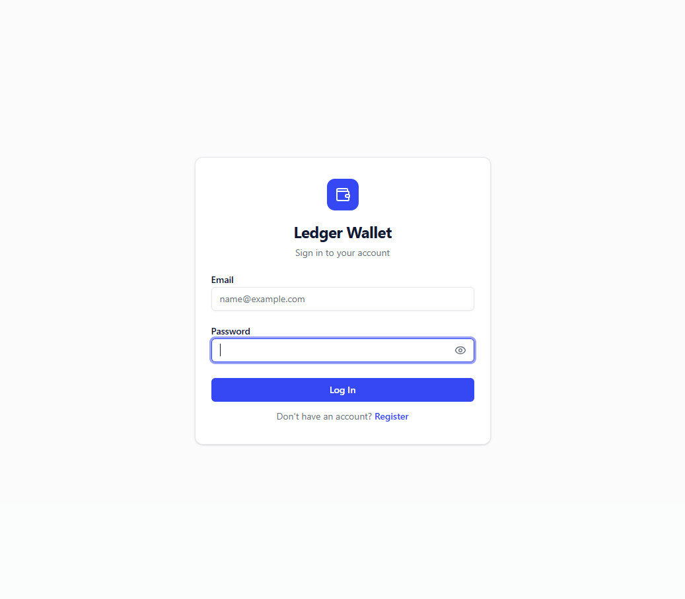
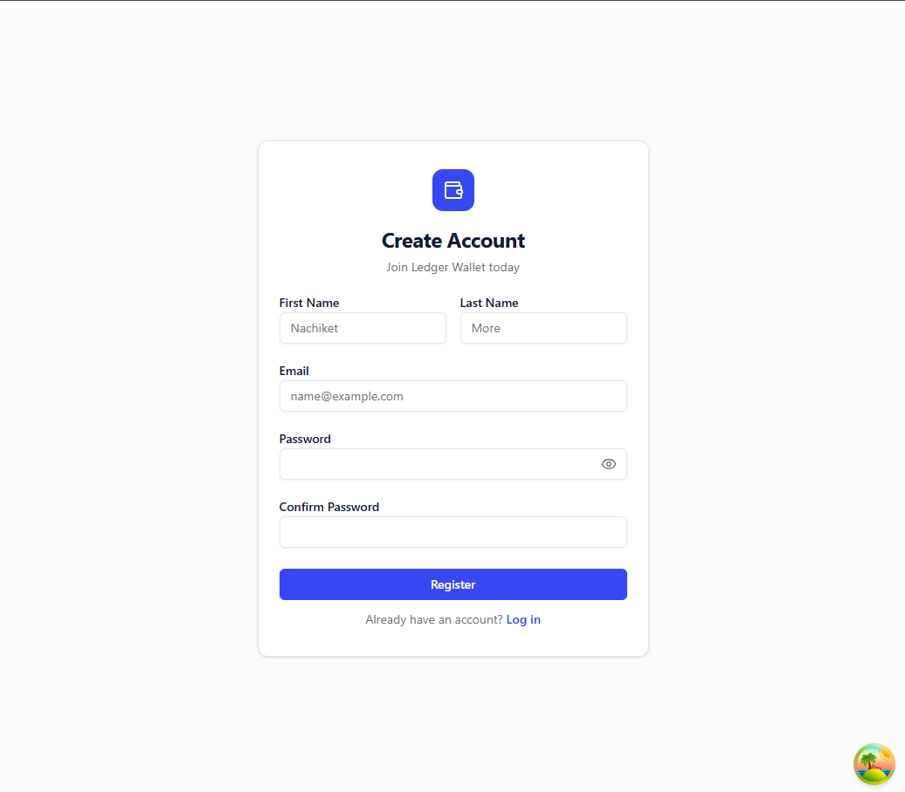
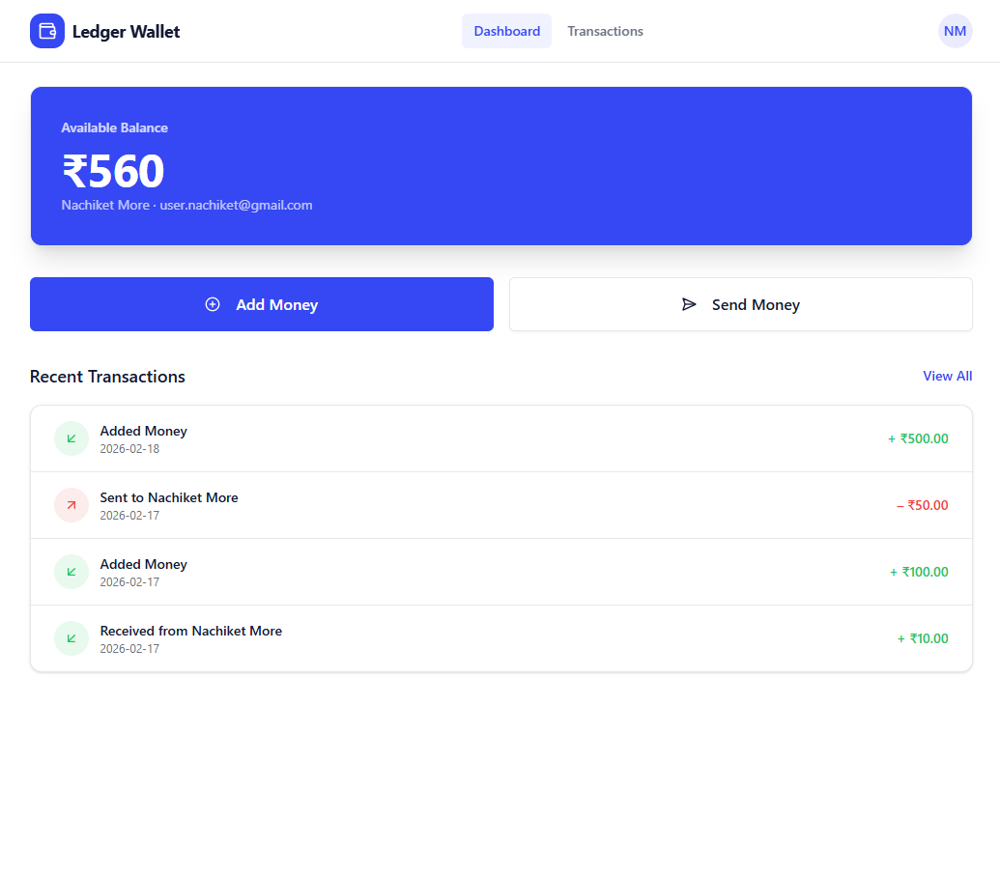
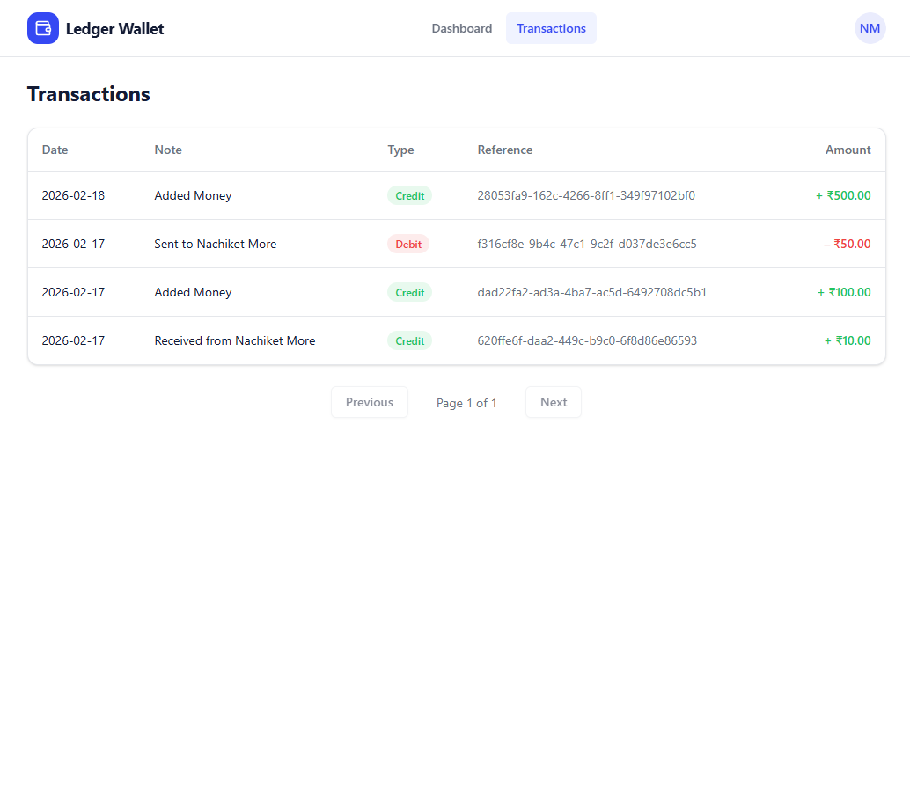
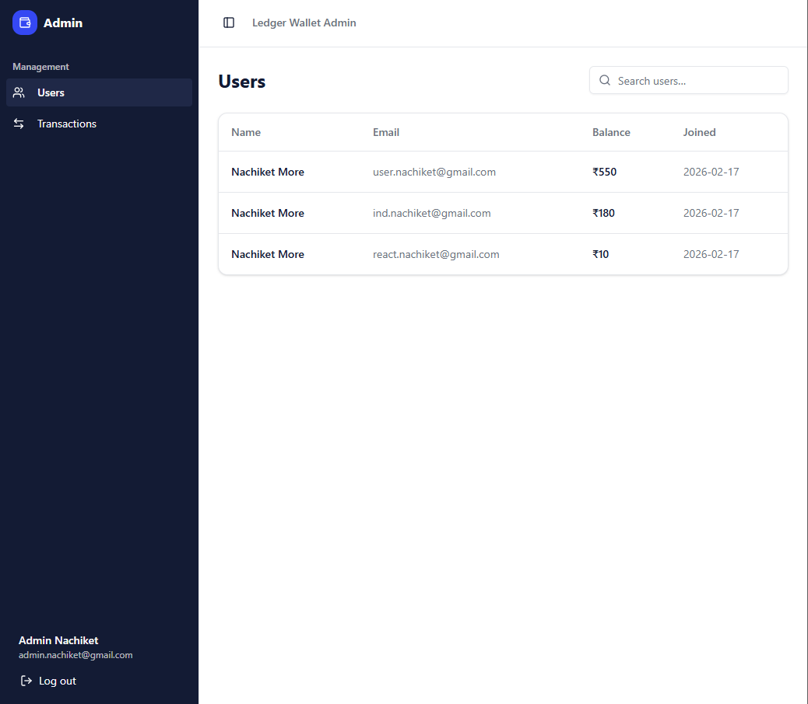
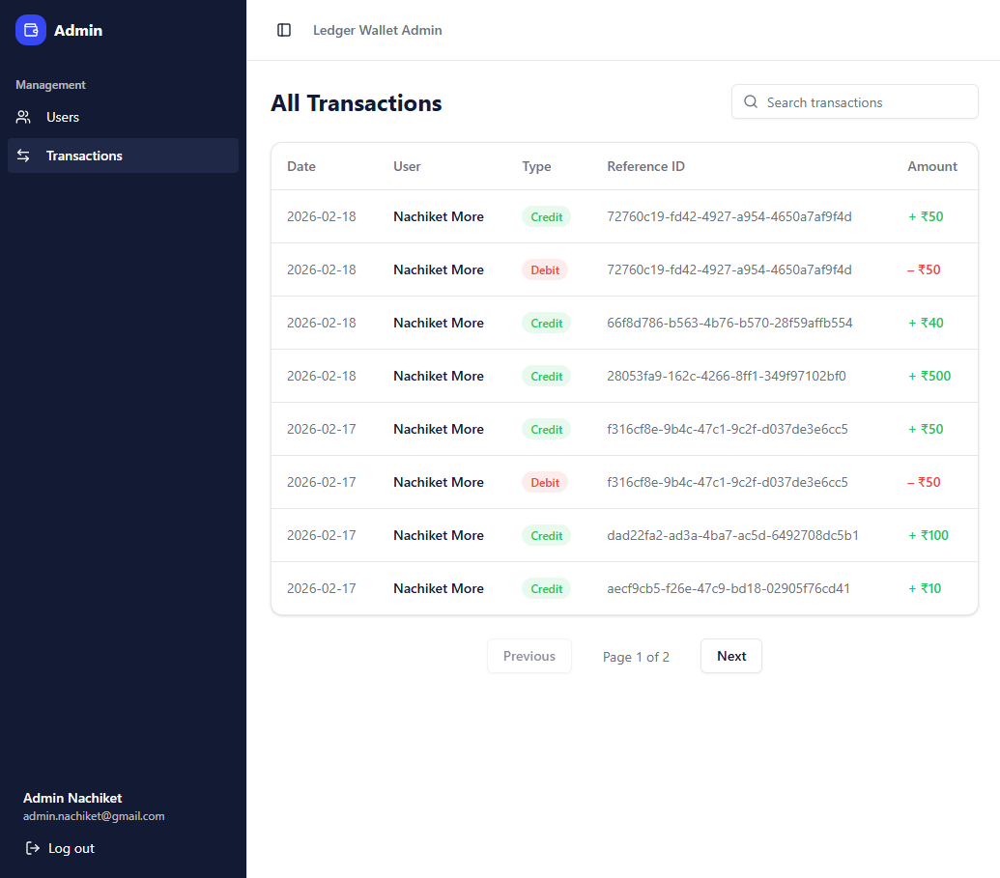
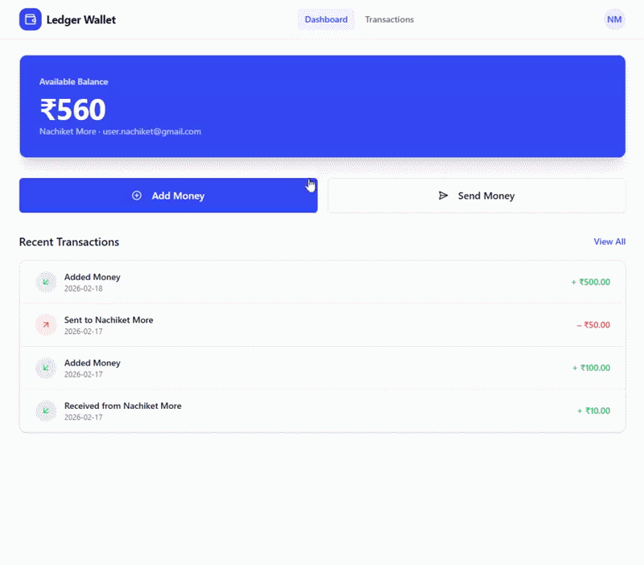
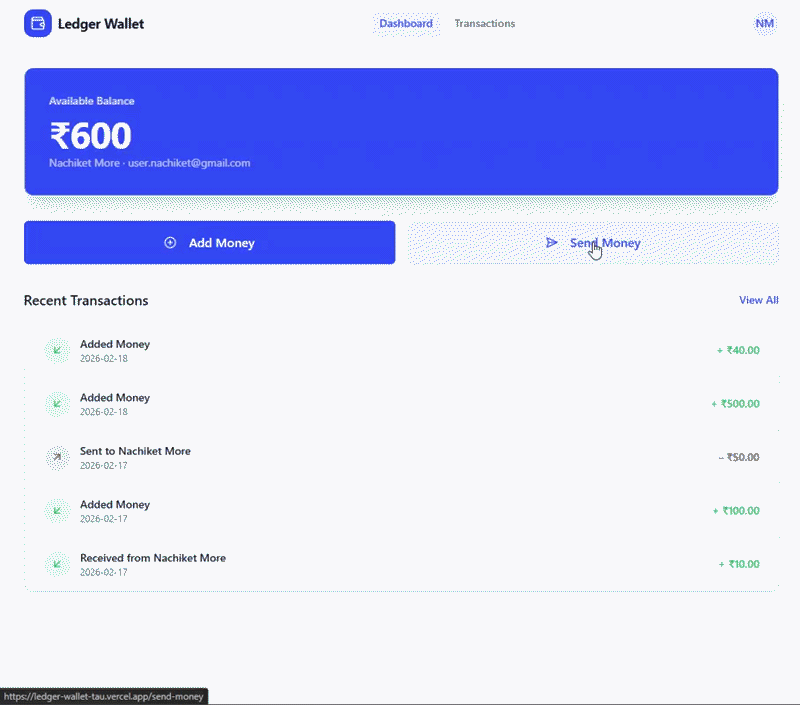

# Ledger Wallet - Digital Wallet & Payments Web App

A production-ready full-stack fintech web app simulating a digital wallet with payments, transfers, and admin management. Built with **React + Tailwind**, **NestJS**, **PostgreSQL (Neo in prod)**, and **Redis** for caching and concurrency locks. This application features robust ledger-based accounting, mock payment integrations, and a secure role-based administrative management system.

**Live Demo**: https://ledger-wallet-tau.vercel.app/

---

## Table of Contents

- [Features](#features)  
- [Tech Stack](#tech-stack)  
- [Folder Structure](#folder-structure)  
- [Screenshots & Diagrams](#screenshots--diagrams)  
- [Getting Started](#getting-started)  
- [Documentation](#documentation)  
- [Future Improvements](#future-improvements)  
- [License](#license)  


## Features

### Authentication & Roles
* User registration and login
* JWT-based auth
* Role-based access (USER / ADMIN)

### Wallet
* Ledger-based accounting (DEBIT/CREDIT)
* Real-time balance with Redis caching
* Recent transactions displayed on dashboard

### Payments
* Add money using mock Razorpay
* Webhook simulation to confirm payments

### Transfers
* Send money to other users
* Redis lock ensures safe concurrency

### Admin Panel
* View all users and transactions
* Search functionality

---

## Tech Stack

| Layer | Technology |
| :--- | :--- |
| **Frontend** | React, TypeScript, TailwindCSS, Vite |
| **Backend** | NestJS, TypeScript, Prisma ORM |
| **Database** | PostgreSQL / Neo (Production) |
| **Cache/Locks** | Redis / Upstash (Production) |
| **Deployment** | Vercel (Frontend), Render (Backend) |
| **Payments** | Mock Razorpay + Webhook Simulation |

---

## Folder Structure

```text
ledger-wallet/
├── frontend/             # React + Tailwind project
│   ├── src/
│   │   ├── api/          # Axios/http requests, API service calls
│   │   ├── components/   # Reusable UI components (buttons, cards, modals)
│   │   ├── hooks/        # Custom React hooks (e.g., useAuth, useWallet)
│   │   ├── layouts/      # Layout components (header, footer, sidebar)
│   │   ├── pages/        # Page components (Home, Dashboard, Admin pages)
│   │   └── App.tsx       # Root app component, route setup
├── backend/              # NestJS project
│   ├── src/
│   │   ├── admin/        # Admin-related routes & logic
│   │   ├── auth/         # JWT authentication & Passport strategies
│   │   ├── decorators/   # Custom NestJS decorators
│   │   ├── guards/       # Auth/role guards for route protection
│   │   ├── health/       # Health check endpoints
│   │   ├── payment/      # Payment gateway integration 
│   │   ├── prisma/       # Prisma ORM setup & database models
│   │   ├── redis/        # Redis caching
│   │   ├── transfer/     # Money transfer / ledger logic
│   │   ├── user/         # User profile, registration & management
│   │   ├── wallet/       # Wallet balance & ledger operations
├── README.md
```

## Screenshots & Diagrams### Login / Register
<p float="left">
  <a href="docs/screenshots/login.png">
    
  </a>
  <a href="docs/screenshots/register.png">
    
  </a>
</p>

### Dashboard / Transactions
<p float="left">
  <a href="docs/screenshots/dashboard.png">
    
  </a>
  <a href="docs/screenshots/transactions.png">
    
  </a>
</p>

### Admin Panel
<p float="left">
  <a href="docs/screenshots/admin-users.png">
    
  </a>
  <a href="docs/screenshots/admin-transactions.png">
    
  </a>
</p>

### Add Money Workflow
<p float="left">
  <a href="docs/screenshots/add-money-workflow.gif">
    
  </a>
</p>

### Transfer Workflow
<p float="left">
  <a href="docs/screenshots/transfer-workflow.gif">
    
  </a>
</p>


### Database Schema: [docs/diagrams/database-schema.png](docs/diagrams/database-schema.png)

## Getting Started
#### Backend
```bash
cd backend
npm install
cp .env.example .env
# set DATABASE_URL, REDIS_HOST, REDIS_PORT, JWT_SECRET
npm run start:dev
```

#### Frontend
```bash
cd frontend
npm install
cp .env.example .env
# set VITE_API_URL
npm run dev
```
## Documentation
* [API Documentation](docs/API.md) - All backend endpoints with request/response examples.
* [Architecture & System Design](docs/ARCHITECTURE.md) – High-level system design, Redis caching strategy, concurrency control, and data flow.

## Future Improvements
* Integrate real payment gateways (Stripe / Razorpay)
* Email / push notifications for transactions
* Multi-currency support
* Advanced analytics and charts for Admin panel

## License
MIT License - see [LICENSE](./LICENSE)